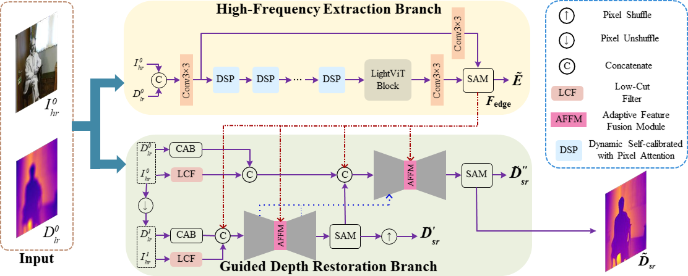

# DSR-EI
This repo is the PyTorch implementation of our paper in CVIU-2023. The algorithm can be used to perform DSR-EI, and its architecture is



## Checkpoints
All pre-trained models can be found [here]().

## Datasets
### NYUv2
We use a [preprocessed version](https://drive.google.com/drive/folders/1_1HpmoCsshNCMQdXhSNOq8Y-deIDcbKS?usp=sharing) provided [here](https://github.com/charlesCXK/RGBD_Semantic_Segmentation_PyTorch#data-preparation).
### RGBDD
We follow [He et al. (Towards Fast and Accurate Real-World Depth Super-Resolution: Benchmark Dataset and Baseline)](https://openaccess.thecvf.com/content/CVPR2021/papers/He_Towards_Fast_and_Accurate_Real-World_Depth_Super-Resolution_Benchmark_Dataset_and_CVPR_2021_paper.pdf) and use the data provided [here](https://github.com/lingzhi96/RGB-D-D-Dataset) (need to assign release agreement).
### DIML
Download the indoor data sample from [[here]](https://dimlrgbd.github.io) and extract it into `./data/DIML/{train,test}` respectively. Then following [Learning Graph Regularisation for Guided Super-Resolution](https://github.com/prs-eth/graph-super-resolution), run `python scripts/create_diml_npy.py ./data/DIML` to create numpy binary files for faster data loading.

## Train and Test (take $4\times$ as an example)
Specify your own 'dataset_path', 'dataset', 'data_root', 'epoch' and the corresponding 'first_cycle_steps' in main.py. Then train of test the model using the following code:
> python ./main.py --scale 4 --scratch

> python ./main.py --scale 4 --test --best

## Citation

```
@article{qiao2023depth,
title = {Depth super-resolution from explicit and implicit high-frequency features},
journal = {Computer Vision and Image Understanding},
volume = {237},
pages = {103841},
year = {2023},
issn = {1077-3142},
author = {Xin Qiao and Chenyang Ge and Youmin Zhang and Yanhui Zhou and Fabio Tosi and Matteo Poggi and Stefano Mattoccia}}
```
